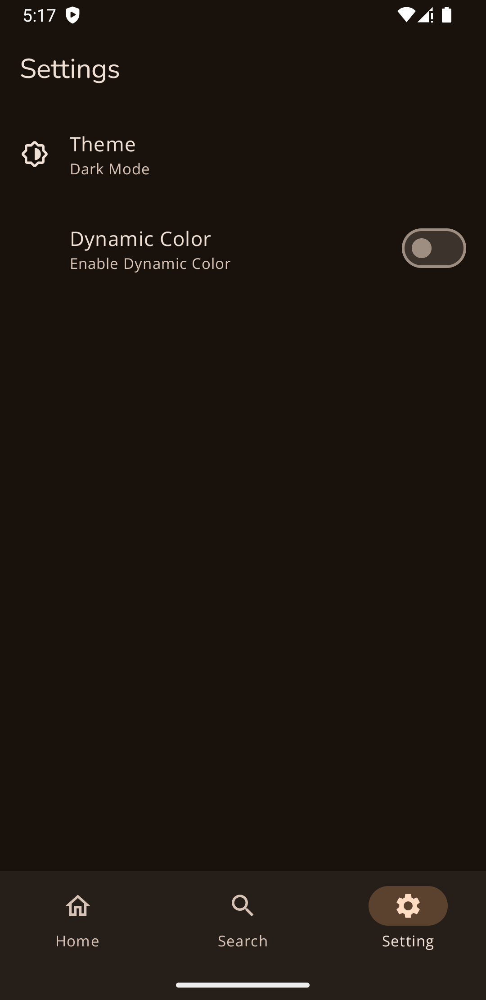

# Github API Compose

An Github API app study implementing Jetpack Compose

## Environment Variables

To run this project, you will need to add the following environment variables to your local.properties file generated by Android Studio

`API_KEY` = Your Github Token Key

## Screenshots

|  |  |
| :--------------------------------------------------------------: | :--------------------------------------------------------------: |
|                             Home                                 |                             Detail User                          |

|  |  |  |
| :--------------------------------------------------------------: | :--------------------------------------------------------------: | :--------------------------------------------------------------: |
|                            Favorites                             |                             Search User                          |                             Settings                             |

## Library Used
- Jetpack Compose
- Retrofit
- Room
- Lottie
- Google Fonts
- Dagger & Hilt
- DataStore
- Coil

## Technology used
- Dependency injection
- MVVM + Repository Pattern
- 
